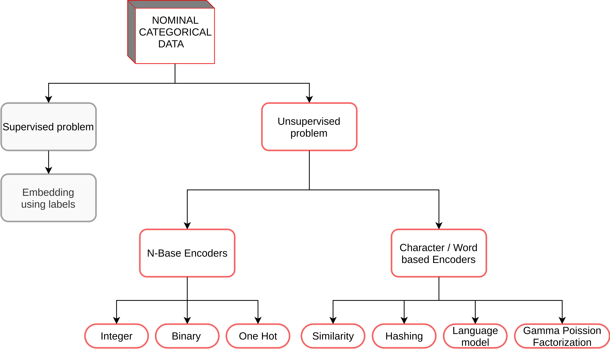
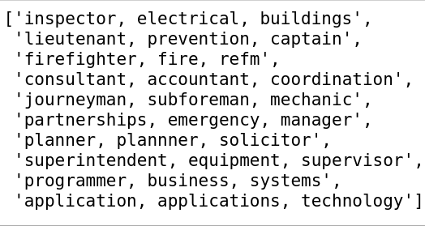
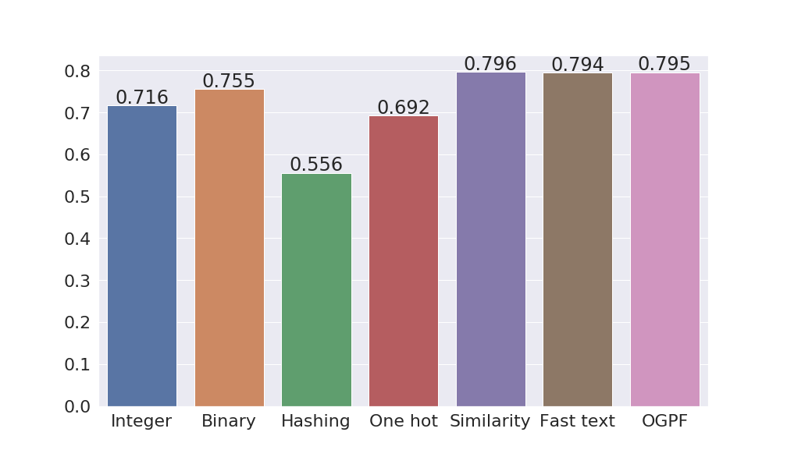
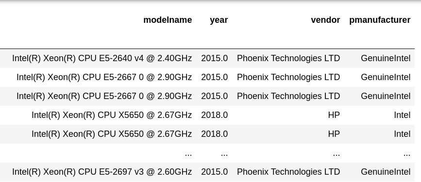
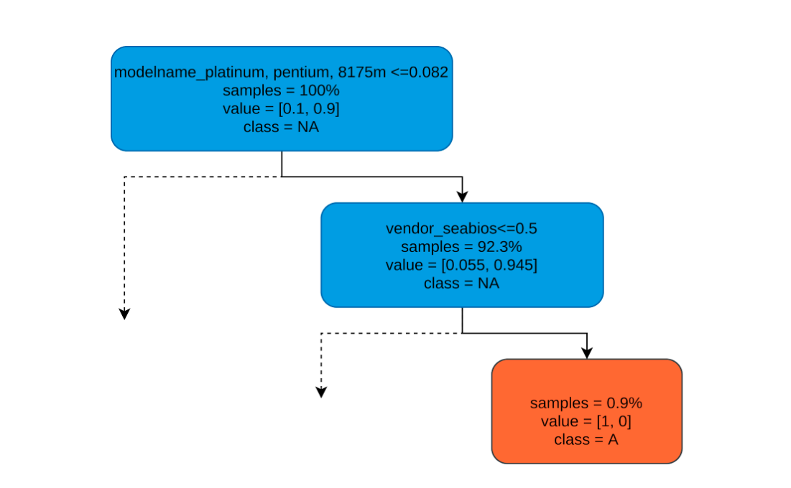

_Authors:_ Shrey Anand (shanand@redhat.com)

_Tags:_ Categorical encoding, unsupervised learning, word embeddings, tabular data, nominal categorical variables, explainability, decision making

## Introduction

Unsupervised learning problems such as anomaly detection and clustering are challenging due to the lack of labels required for training embeddings and validating the results. Therefore, it becomes essential to use the right encoding schemes, dimensionality reduction methods, and models. In these types of learning problems, manipulating numerical variables is straightforward as they can be easily plugged into statistical methods. For example, it is easy to find mean and standard deviations in the height of a population.

Categorical variables need to be handled carefully as they have to be converted to numbers. Ordinal categorical variables have an inherent ordering from one extreme to the other, for e.g., sentiment can be very negative, negative, neutral, positive, and very positive. We can use simple integer encoding or contrast encoding for these variables.

Figure 1: Encoders for nominal categorical variables

In this blog, we focus on encoding schemes for nominal categorical variables. Figure 1 summarizes the commonly used encoders for these problems. These variables are particularly challenging because they have no inherent ordering, for e.g., weather can be rainy, sunny, snowy, etc. Encoding to numbers is challenging because we want to avoid distorting the distances between the levels of the variables. In other words, if we encode rainy as 0, sunny as 1, and snowy as 2 then the model will interpret rainy to be closer to sunny than snowy which is not true. A common approach is to use a one-hot encoding scheme. The method works well because all the one-hot vectors are orthogonal to each other preserving the true distances. However, when the cardinality of the variables increases, one-hot encoding explodes the computation. For example, if we have 1000 different types of weather conditions then one-hot would give a 1000 dimension vector. To improve performance, we may choose to reduce dimensions using various forms of matrix decomposition techniques. However, since we cannot go back to the original dimensional space, we lose explainability in this process. Therefore, we search for encoders that optimally balance the trade-off between performance and explainability.

#### Impact

Red Hat collects systems data from RHEL and Openshift subscribers. A lot of these data points are nominal categorical such as the CPU model name: _Intel Xeon CPU E5-2643_, _Intel Xeon Platinum 8175M_, _AMD Opteron Processor 6176 SE_. Other examples include categorical variables in Linux configuration files, product names, alert names, and various log files keys. The artifacts derived from these experiments can directly benefit unsupervised problems with these datasets.

The following video presents a brief description of the project and how to get started.

`video: https://youtu.be/9zOSg3KANDA`

## Encoding

In this section, we describe various types of encoders that we experimented with. For each encoder, we briefly describe the process of encoding and also their pros and cons in terms of performance and explainability. For a better explanation, we are using an example categorical variable employee title that could have values such as software developer, civil engineer, etc.

### Base N Encoders

Base N Encoders directly convert the categories into numbers. We show three different methods:

##### Label / Integer Encoding

- Process
  - Base = N
  - Convert categories to integers
  - For example, all _Civil Engineer I_ will be represented by integer _k_
- Pros
  - Easy to implement and use
  - Least number of output vector dimensions
- Cons
  - Usually, a poor choice as it adds random ordinality. In other words, the distances between categories are distorted which can give unreliable results

##### One-Hot Encoding

- Process
  - Base ~ 1
  - Create one column per category
  - Mark it 1 if the category is present in the row, 0 if it is not
- Pros
  - Does not distort distance between the categories
- Cons
  - Results in a very high dimension that is difficult to manipulate

##### Binary Encoding [[1](http://www.willmcginnis.com/2015/11/29/beyond-one-hot-an-exploration-of-categorical-variables/)]

- Process
  - Base = 2
  - First, the categories are encoded as ordinal
  - Integers are converted into binary code
  - Digits from that binary string are split into separate columns
- Pros
  - This encodes the data in fewer dimensions than one-hot encoding
- Cons
  - There is still some distortion of distances between categories
  - Inverse mapping wouldn’t be perfect
  - For e.g., if we have four categories: 00, 01, 10, 11 then we have two features. If the first feature is 0 it could mean both 00 and 01

### Hashing

This encoder uses the hashing trick to represent a high dimension space in a low dimension space while preserving sparsity. [[2](https://booking.ai/dont-be-tricked-by-the-hashing-trick-192a6aae3087),[ 3](https://www.youtube.com/watch?v=SLqKepl9rEo&t=473s)]

- Process
  - Converts variable to string “variable=category”, e.g., “modelname=Intel”
  - Converts this string to an integer using a hashing function
  - Modulus this integer by the length of output vector required
  - Uses that index for indicator 1 (Essentially one-hot encoding in lower dimension)
- Pros
  - Fast and saves memory as the output vector is in a smaller dimension
  - Can be used for multiple categorical variables at the same time
- Cons
  - Collisions happen if the output vector size is small
  - Inverse mapping is not available so no interpretation

### Word Based Encoders

#### Language Model: Fasttext Encoder [[4](https://arxiv.org/abs/1607.04606)]

- Process
  - Downloads a pre-trained language model on English words
  - For each category, performs a forward run of the pre-trained model
  - Outputs the vectors from the last layer of the model
- Pros
  - Dynamic length of the output vector
  - Captures meaning in the words or categories
- Cons
  - Heavy file size of the pre-trained model
  - May not work well with words that don't appear a lot in natural English
  - Output vector dimensions have no explainability

##### Similarity Encoder [[5](https://dirty-cat.github.io/stable/generated/dirty_cat.SimilarityEncoder.html)]

- Process
  - Create one column per category
  - Define n-gram similarity
  - For each category, compare similarity with other categories
  - Instead of 0 and 1 in one-hot encoding use similarity value
  - E.g. Categories: _Associate Software Developer_, _Software Developer_, _Senior Software Developer_
- Pros
  - In high cardinality, categorical variables different entries are often variations on the same entities
  - Using simple one-hot encoding will create orthogonal features, whereas it is clear that those 3 terms have a lot in common.
  - If we wanted to use word embedding methods such as word2vec, we would have to go through a cleaning phase: those algorithms are not trained to work on data such as _Accountant/Auditor I_. However, this can be error-prone and time-consuming.
  - The high dimensions can be meaningfully reduced to lower dimensions: _All_ to _Software developer_s, similar to clustering.
- Cons
  - High dimensional output vector
  - Works only with variables that have meaningful substring overlaps

##### Online Gamma Poisson Factorization [[6](https://arxiv.org/pdf/1907.01860.pdf)]

- Process
  - Estimates a decomposition of the string entries in terms of a linear combination of latent categories.
  - Similar to LDA [[7](https://en.wikipedia.org/wiki/Latent_Dirichlet_allocation)] for finding topics in documents but since the string entries here are much shorter than text documents and can contain typos, it uses ngrams level representation.
- Pros
  - Low number of dimensions
  - The reduced dimensions can be interpreted as a combination of topic words and hence it has some degree of interpretability
- Cons
  - Works only with variables that have meaningful substring overlaps
  - The interpretations are probabilistic

#### Interpretation using this encoder

To illustrate the interpretation capabilities of this method, we use the example of employee titles. The encoder converts the data into output vectors of length 10 (10 components). The following list shows dominant keywords in each of the 10 components.

Figure 2: Dominant keywords describing output vector’s dimensions

## Evaluation

For evaluating the performance of these methods, we take a dataset with different employment position titles and their corresponding remuneration. We encode the categorical variable _position title_ using the methods described above. Then, we define a dummy binary classification task of predicting whether or not the employee earns more than 100,000 units. To evaluate the performance of each encoding method, we use the same xgboost classification algorithm. Figure 3 shows the results obtained. Word-based encoders outperform the base N encoders. The hashing encoder performed the worst followed by one-hot, integer, and binary encoder. Similarity encoder performed the best with online gamma poisson factorization (OGPF) as a close second.

Figure 3: Weighted average f1 scores of encoding schemes

## Application

Next, we are going to see how we can apply gamma poisson factorization in an unsupervised setting.

Figure 4: Data set of system hardware configurations

- **Data:** We use a data set of hardware configuration of user systems. Figure 4 shows the system configurations.

- **Problem:** Our aim is to find configurations that are outliers and rules that determine that these configurations are outliers.

- **Encoding:** We use gamma poisson factorization for the variable _modelname_ since it has a high cardinality. For the rest, we use one-hot encoding since they have a low cardinality.

- **Outlier detection:** To find the outliers, we use the isolation forest [[8](https://cs.nju.edu.cn/zhouzh/zhouzh.files/publication/tkdd11.pdf)] algorithm that finds points that are easiest to isolate.

- **Interpretation:** Finally, we train a surrogate decision tree based on the labels given by the isolation forest to find rule paths that lead to the outlier classification.

#### **Interpretation**

Figure 5: Example rule path for detecting a system as an anomaly

##### The tree can be interpreted in the following way:

- The nodes represent feature splitting points.
- The first line represents a condition used to split that node.
- The second line specifies the percentage of samples that fall in that node.
- The third line specifies that, for those samples that fall in that node, what percent belong to class Anomaly (orange color) and what % belongs to class Not Anomaly (Blue color)

##### Rule paths

- One-hot encoded variable: if a node says that `vendor_seabios <= 0.5`, that means that for all the systems where the vendor is not _seabios_. Since one-hot encoding means 0 or 1, &lt; 0.5 means 0.
- Gammas Poisson factorized variables: if a node says `modelname_broadwell,skylake,haswell <= R` (real number), then that means that systems that have strings _broadwell_, _skylake_ or _haswell_ in their _modelname_ are important factors for splitting the tree further. In order to decide whether their presence or absence causes these anomalies, further validation has to be done.
- Example rule path found in Figure 4: if (modelname has _platinum_, _pentium_, _8175m_) and (vendor is _seabios_) then it could be an anomaly.

## Conclusion

Encoding nominal categorical variables in unsupervised learning problems while optimizing the trade-off between performance and explainability is a challenging problem. We explored several techniques used in the literature for an example dataset evaluating the pros and cons of each. If the cardinality (number of levels) of nominal categories is less, then one-hot encoding should be preferred as it preserves the distance between the categories. The interpretation of low and high cardinality depends on the domain but high cardinality would imply hundreds of unique category levels. If the cardinality is high, then we have to use the information present in the string of the nominal variable. Word-based encoders like Similarity encoder and online gamma poisson factorization encoder try to extract information from the n-grams (collection of characters) present in the strings. The evidence suggests that they increase the performance of the classifier indicating that they provide meaningful representation. The online gamma factorization encoder also provides an interpretation of the reduced dimensional space which can be useful in unsupervised tasks. In the example application of the method to an anomaly detection problem, we saw how it can be effectively used as input to an isolation forest and then interpreted using the feature names.

## References

\[1\] [Binary encoding](http://www.willmcginnis.com/2015/11/29/beyond-one-hot-an-exploration-of-categorical-variables/)

\[2\] [Hashing trick](https://booking.ai/dont-be-tricked-by-the-hashing-trick-192a6aae3087)

\[3\] [Hashing explanation](https://www.youtube.com/watch?v=SLqKepl9rEo&t=473s)

\[4\] [Fasttext encoder](https://arxiv.org/abs/1607.04606)

\[5\] [Similarity encoder](https://dirty-cat.github.io/stable/generated/dirty_cat.SimilarityEncoder.html)

\[6\] [Online Gamma Poisson Factorization](https://arxiv.org/pdf/1907.01860.pdf)

\[7\] [Latent Dirichlet allocation](https://en.wikipedia.org/wiki/Latent_Dirichlet_allocation)

\[8\] [Isolation forest](https://cs.nju.edu.cn/zhouzh/zhouzh.files/publication/tkdd11.pdf)

* **[Get Started](./get-started.md)**

* **[How to Contribute](./contribute.md)**

* **[Project Content](./content.md)**
